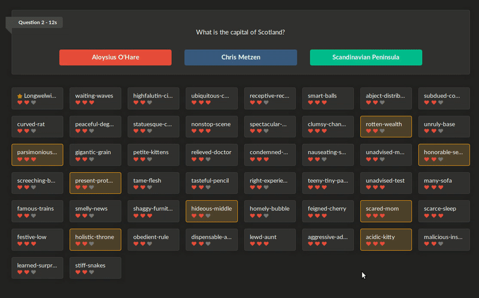

# Majority



Majority is a multiplayer game where players are faced with questions and totally random answers.
The goal is to guess which answers will be picked the _majority_ of the players.

## Deploy on Heroku

```bash
heroku git:remote -a majority-longwelwind
heroku config:set DATABASE_URL=<url>
heroku config:set HTTP_API_TOKEN=<token>
heroku config:set PROMETHEUS_PASSWORD=<pwd>
heroku domains:add majority.longwelwind.net
git push heroku master
```

## Deploy on Dokku

```bash
dokku apps:create majority
dokku postgres:create majority
dokku postgres:link majority majority
dokku config:set majority HTTP_API_TOKEN=<token>
dokku config:set majority PROMETHEUS_PASSWORD=<pwd>
git push dokku master
```
